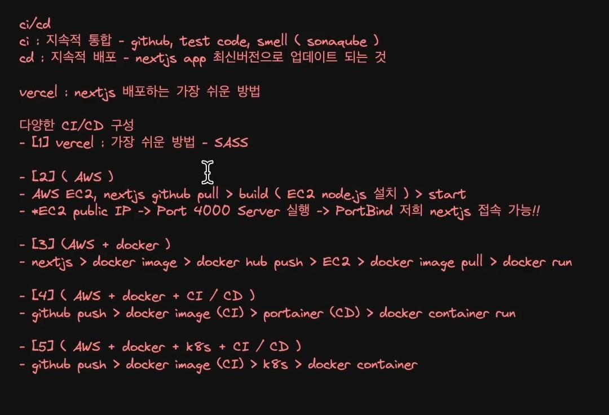

# 1 nextjs 프로젝트 시작하기
0. npx create-next-app@14.1.0

# 2. 필요한 패키지 미리 설치
( version issue에 대응하여 특정 버전으로 설치하기 )   
1. yarn add react-spinners@^0.13.8
2. yarn add react-icons@^5.0.1
3. yarn add tailwind-merge@^2.2.1
4. yarn add zustand@^4.5.0

# 3. install shadcn
- 설치법 : https://ui.shadcn.com/docs/installation/next
- https://ui.shadcn.com/docs/components/carousel 등 사용 가능

5. npx shadcn-ui@latest init

✔ Which style would you like to use? › Default
✔ Which color would you like to use as base color? › Slate
✔ Would you like to use CSS variables for colors? … no / yes

- tailwind.config.ts > content 부분에 js,ts,jsx,tsx,mdx 라고 해야지 jsx에도 tailwind css 가 적용된다.

# 4. darkmod
- https://ui.shadcn.com/docs/dark-mode/next

yarn add next-themes
- 다크모드 provider 제공
- .dark 클래스에 다크 모드 관련 색상이 정의 된다.

라이브러리 소개
Next.js 14:

Next.js는 React 기반의 웹 프레임워크로, SSR(Server-Side Rendering) 및 정적 사이트 생성을 지원
1. https://nextjs.org/
Tailwind CSS:

Tailwind CSS는 클래스 기반의 유틸리티 퍼스트(CSS Utility-First) 프레임워크
HTML 클래스에 직접 스타일을 적용하여 디자인을 구축
2. https://tailwindcss.com/docs/installation
Radix UI:

Radix UI는 저수준(UI primitives) 컴포넌트를 제공하는 라이브러리
컴포넌트를 많이 분리해두어서 커스터마이징이 거의 다 된다.
tailwind css 지원
3. https://www.radix-ui.com/primitives/docs/overview/introduction
Shadcn:

Shadcn은 그림자 및 빛 효과를 생성하기 위한 CSS 클래스 유틸리티 라이브러리
radix ui 기반 컴포넌트 라이브러리 제공 + tailwind css 지원
4. https://www.radix-ui.com/primitives/docs/overview/introduction
React-Spinners, React-Icons

React-Spinners는 리액트 애플리케이션에서 로딩 스피너
React-Icons는 다양한 아이콘
5. https://ui.shadcn.com/

React-incon
6. https://react-icons.github.io/react-icons/

# 배포

1. https://vercel.com/

